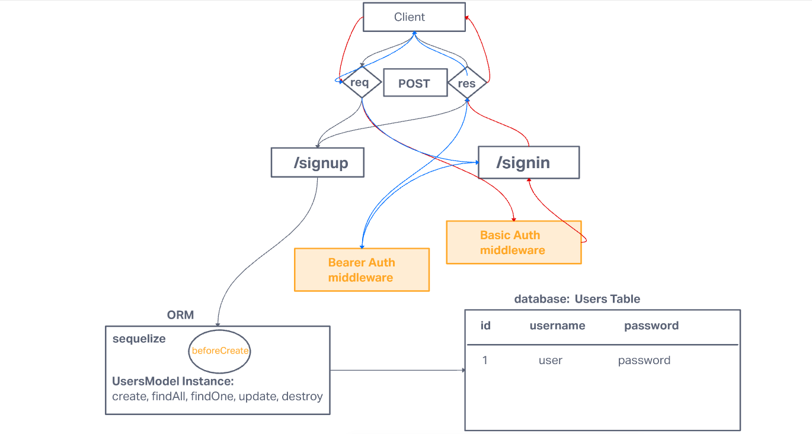

# LAB - Class 7

## Project: Bearer Auth

### Author: Yen Xiong Yuan

### Problem Domain

#### As a user, I want to obtain a token after I signin, so that I can re-authenticate

* Using an HTTP REST client, or a web form:   
      - Following a POST to /signup to create an account (or) Following a   
      - POST to /signin with basic authorization   
      - Send a response to the client with the proper status code along with an object with the following properties   

#### As a user, I want to use my token to access routes that require a valid user

* Using an HTTP REST client, send a request to a “protected” route, such as /secretstuff  
      - Your request must send an “Authorization” header, with the value of Bearer TOKEN   
      - TOKEN is the token that you would have returned to the user after their signin step (above)

      - If the TOKEN is valid (i.e. if it represents an actual user)  
      - The route should function as it normally would (sending a response)   

      - If not
      - Send the user an error message stating “Invalid Login”

#### As the website owner, I want our token system to be as secure as possible so that our users can feel safe when logging in

* Research ways to “secure” our JWT Tokens  
* Implement one or more methods to secure our login tokens  
    

### Links and Resources

- [GitHub Actions ci/cd](https://github.com/yenxiongyuan/bearer-auth/actions)

### Setup

#### `.env` requirements (where applicable)

for now I have none and do not require one

#### How to initialize/run your application (where applicable)

- e.g. `npm start`

#### How to use your library (where applicable)

#### Features / Routes

- Feature One: Details of feature
- GET : `/hello` - specific route to hit

#### Tests

- How do you run tests?
- Any tests of note?
- Describe any tests that you did not complete, skipped, etc

#### UML

